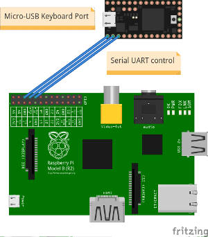

Etherkey
========
Emulate a conventional USB keyboard with a scriptable network capable microcontroller.

By using dedicated hardware it is possible to control systems even before the operating system is booted and without being dependent on the running software. For example this allows automatic bootloder selectios or modification of BIOS settings.

Requirements
------------
* [Teensy 3](https://www.pjrc.com/teensy/index.html)
* [Raspberry PI](http://www.raspberrypi.org/) (Optional for network features)

Setup
-------
Example setup with a Raspberry PI for the ethernet connection. (The Teensy can also be conntrolled directly over the Serial UART)

Install
-------
* Flash the Teensy with the sketch in the etherkey folder. (Using [Teensyduino](https://www.pjrc.com/teensy/teensyduino.html))
* Connect to the Teensy over the serial UART ports

### Configuring the raspberry to use the serial port
When using Raspbian as operating system, the serial port [must be configured for outgoing connections](http://elinux.org/RPi_Serial_Connection#Connection_to_a_microcontroller_or_other_peripheral).

After that a serial connection can be established with `cu -l /dev/ttyAMA0 -s 115200`

Usage
-----
Available modes:

* Interactive mode
* Command mode
* Debug mode

`Ctrl-Q` to switch between modes.

### Interactive mode
Directly sends the recieved keystroke
Supported Characters

* All printable ASCII characters
* Arrow keys
* Backspace
* Enter
* Delete
* Tab
* Escape

### Command mode
Parses the whole line and interprets the first Word as command. Available commands:

#### SendRaw
Sends the rest of the line literally

#### Send
Sends the rest of the line while interpreting special characters.
This command behaves similarly to the send command of [AutoHotkey](http://ahkscript.org/docs/commands/Send.htm)

#### UnicodeLinux or UCL
Initializes the GKT+/Qt Unicode Sequence and sends the following 4-digit hexadecimal Unicode Character.

#### UnicodeWindows or UCW (experimental)
Initializes the Windows Unicode Sequence and sends the following Unicode Character. Please note: Some Windows applications require 4-digit decimal Code (e.g. Wordpad, Chrome), some other require 4-digit hexadecimal Code (e.g. Notepad++, Firefox)
You might as well need to [change a Registry Setting](http://en.wikipedia.org/wiki/Unicode_input#In_Microsoft_Windows) on your Windows machine.

##### Modifiers
The following characters are treated as modifiers:

* `!`: Send the next character with the ALT key pressed.
	* Example: `Send text!a` sends the keys "This is text" and then presses `ALT+a`.

* `+`: Send the next character with the SHIFT key pressed.
	* Example: `Send +abC` sends the keys "AbC".

* `^`: Send the next character with the CTRL key pressed.
	* Example: `Send ^c` sends a `CTRL+c` keystroke.

* `#`: Send the next character with the WIN key pressed.
	* Example: `Send #d` sends a `WIN + d` keystroke.

These modifiers can be combined, so a `^+t` would send a `CTRL+SHIFT+t`, thus restoring the last tab in Firefox.

##### Keynames
Non printable characters can be sent by specifying the keyname enclosed in braces:

* `{Enter}`
* `{Escape}`
* `{Space}`
* `{Tab}`
* `{Backspace}/{BS}`
* `{Delete}/{Del}`
* `{Insert}/{Ins}`
* `{Up}`
* `{Down}`
* `{Left}`
* `{Right}`
* `{Home}`
* `{End}`
* `{PgUp}`
* `{PgDn}`

### Debug mode
Displays information about the received character (ASCII code, USB keycode)
